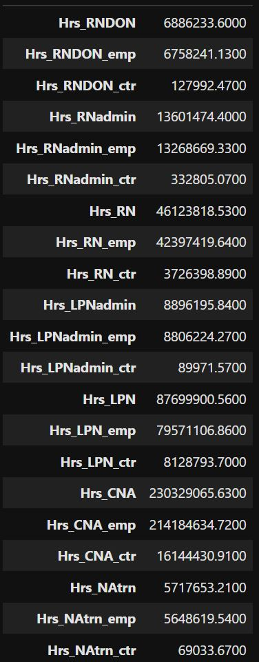
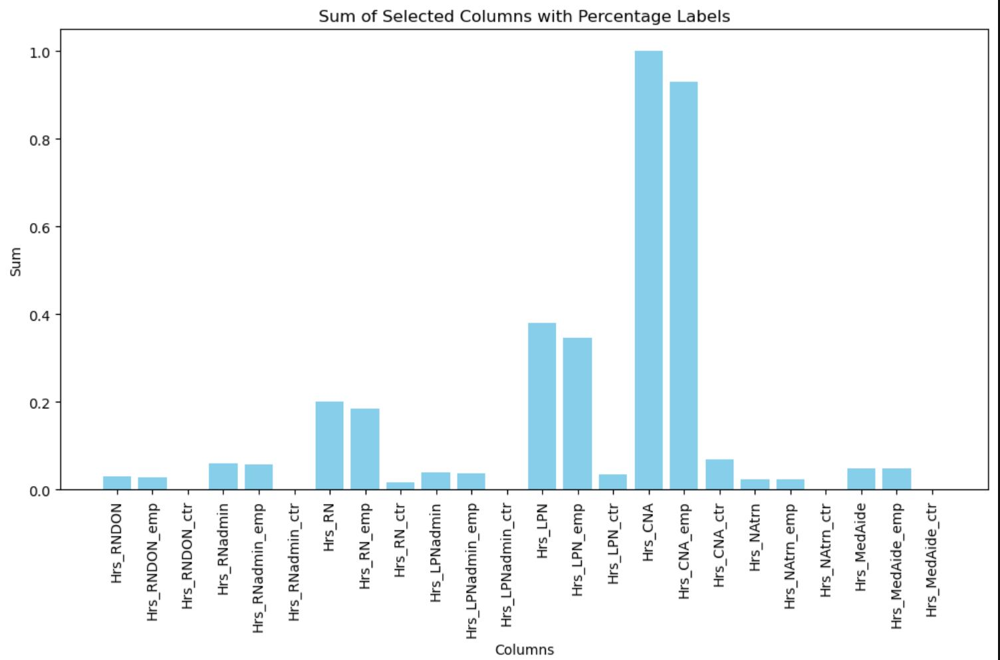

# Data-Exploratory-Analysis 
Clipboard Health is a  staffing agency that staffs to long-term care facilities. The Centers for Medicaid and Medicare Services publish a quarterly report containing daily staffing data for all registered nursing homes in the U.S. This dataset is called Payroll Based Journal (PBJ) Daily Nurse Staffing. 
Nursing homes are staffed by both employees and contractors. Employees work for the nursing home full time, whereas contractors work for the nursing home on a temporary basis. Most nursing homes are staffed using some combination of full time employees and contractors, but the proportions within each nursing home can vary substantially. All workers from Clipboard Health (and competitors) are classified as contractors.
Clipboard Health is a nationwide staffing platform, operating in all 50 states.

## Find all the columns with the most zeros

## We can see after graphing the missing values that most columns are missing a good percentage of hours.

Further analysis shows that the columns with the most zeros are those that have ctr at the end. Meaning that those are contract employees.
This implies that full time employees that are not on contract are more employed that those that are on contract.
We see that full time employees(emp) and part time contractors(ctr) hours all add up the overall hours of their positions.From the above graphs we see the contract employees have less hours and therefore underemployed

## Looking Deeper

Digging deep we see that job positions with more senior titles such as **Director** or **Admin** are more likely to be full time employees rather than part-time/contract.
We see that full time employees(emp) and part time contractors(ctr) hours all add up the overall hours of their positions.From the above graphs we see the contract employees have less hours and therefore underemployed.

